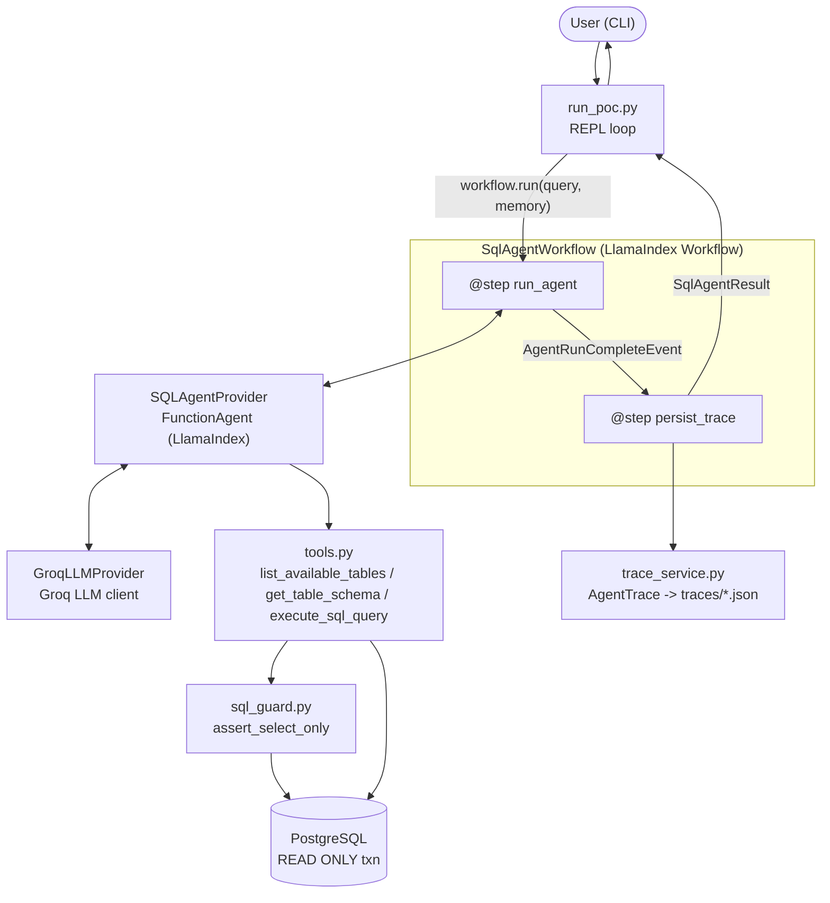
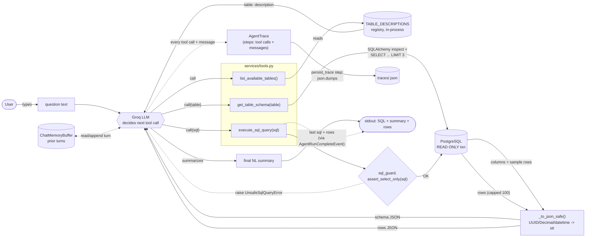
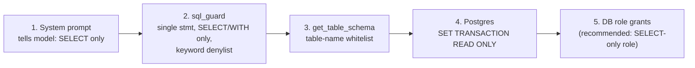

# Implementation Notes — NL-to-SQL Agent

How the POC actually works under the hood. For setup/usage see [README.md](README.md).

## Approach

- **Agentic tool-calling, not text-to-SQL prompting.** The LLM never gets the schema
  dumped into its prompt. Instead it's given three tools and told (via the system
  prompt) to discover the schema itself before writing SQL. This keeps the prompt
  small and forces the model to only look up tables it actually needs.
- **Read-only by construction, not by instruction.** The system prompt tells the model
  to only write `SELECT`, but that instruction is never trusted on its own — see
  [Security layers](#security-layers-defense-in-depth).
- **LlamaIndex `FunctionAgent` + Groq.** Groq's Llama models support native function
  calling; `FunctionAgent` handles the tool-call loop (call tool → feed result back →
  repeat until final answer) so there's no hand-rolled orchestration for *that* part.
- **A LlamaIndex `Workflow` around the agent, not just the agent.** The surrounding
  orchestration — run the agent, collect a reasoning trace as tool calls happen,
  persist it, shape the result — used to be inline code in `run_poc.py`'s REPL loop.
  It's now `SqlAgentWorkflow` (`services/sql_agent_workflow.py`): two explicit
  `@step`s (`run_agent`, `persist_trace`) connected by a typed event
  (`AgentRunCompleteEvent`), using the framework's own event-streaming
  (`ctx.write_event_to_stream`) instead of a hand-rolled loop. The agent still
  decides dynamically which tables to inspect and what SQL to write — this doesn't
  turn the pipeline into a fixed, non-agentic sequence, it just formalizes the code
  *around* the agentic part. `run_poc.py` is left with almost nothing to do: await
  the workflow, print the result.
- **Singletons for LLM client and agent** (`GroqLLMProvider`, `SQLAgentProvider`) so
  tool binding and HTTP client setup happen once per process, not once per question.

## Architecture



## Workflow (per user turn)

The system prompt (`core/prompts.py`) locks the agent into a fixed 4-step sequence:
`list_available_tables` → `get_table_schema` (per table) → `execute_sql_query` →
summarize. The sequence diagram below shows how that plays out end to end.

```mermaid
sequenceDiagram
    actor U as User
    participant R as run_poc.py (REPL)
    participant W1 as Workflow.run_agent
    participant A as FunctionAgent
    participant L as Groq LLM
    participant T as tools.py
    participant G as sql_guard
    participant DB as PostgreSQL
    participant W2 as Workflow.persist_trace

    U->>R: types question
    R->>W1: workflow.run(query, memory)
    W1->>A: agent.run(user_msg, memory)
    A->>L: question + tool schemas
    L-->>A: call list_available_tables()
    A->>T: list_available_tables()
    T-->>A: {table: description, ...}
    A->>L: tool result
    L-->>A: call get_table_schema(table)
    A->>T: get_table_schema(table)
    T->>DB: inspect columns + SELECT ... LIMIT 3
    DB-->>T: columns + sample rows
    T-->>A: schema
    A->>L: tool result
    L-->>A: call execute_sql_query(sql)
    A->>T: execute_sql_query(sql)
    T->>G: assert_select_only(sql)
    G-->>T: OK (or raises UnsafeSqlQueryError)
    T->>DB: SET TRANSACTION READ ONLY; run SELECT
    DB-->>T: rows (capped at 100)
    T-->>A: rows
    A->>L: tool result
    L-->>A: final natural-language summary
    A-->>W1: streamed events (ToolCallResult, AgentOutput)
    W1->>W1: ctx.write_event_to_stream(event) for each
    W1->>W1: build AgentTrace from streamed events
    W1->>W2: AgentRunCompleteEvent(response, trace, sql, query_result)
    W2->>W2: save_trace() -> traces/<UTC-timestamp>.json
    W2-->>R: StopEvent(result=SqlAgentResult)
    R-->>U: print SQL, summary, rows
```

`run_agent` consumes `handler.stream_events()` rather than just awaiting the final
result, so it can pull the last executed SQL + rows out of the `ToolCallResult` for
`execute_sql_query`, forward every event via `ctx.write_event_to_stream` (so a future
caller could subscribe to live progress), and record each one into the trace. All of
this used to be inline in `run_poc.py`; now `run_poc.py` only does `await
workflow.run(...)` and prints the `SqlAgentResult`.

## Data flow

Unlike the sequence diagram above (which shows *when* calls happen), this shows *what
data* moves between processes and stores, and how it's shaped at each hop.



Every DB cell (`UUID`, `Decimal`, `datetime`/`date`) is normalized to a JSON-safe
primitive by `tools._to_json_safe` (the `Norm` step above) before it reaches the LLM
or the trace file — otherwise `json.dumps` would fail on those types directly.

## Implementation (by module)

| Module | Responsibility |
|---|---|
| `core/config.py` | `pydantic-settings` — reads `GROQ_API_KEY`, `DATABASE_URL`, model name from `.env`. |
| `core/constants.py` | Row caps, forbidden-keyword denylist, `TABLE_DESCRIPTIONS` registry, trace dir. |
| `core/prompts.py` | All LLM-facing text: system prompt (4-step workflow + SQL hard rules) and tool descriptions. |
| `core/database.py` | `DatabaseSessionProvider` — singleton SQLAlchemy engine. |
| `models/av_platform.py` | SQLAlchemy ORM models for the 11 seeded tables. |
| `services/llm_provider.py` | `GroqLLMProvider` — singleton Groq LLM client. |
| `services/tools.py` | The 3 tool functions + `build_sql_agent_tools()` wrapping them as `FunctionTool`s. |
| `services/sql_guard.py` | `assert_select_only` — strips comments, enforces single statement, `SELECT`/`WITH`-only, keyword denylist. |
| `services/sql_agent_service.py` | `SQLAgentProvider` — singleton `FunctionAgent` wired with tools + system prompt + Groq LLM. |
| `services/sql_agent_workflow.py` | `SqlAgentWorkflow` — LlamaIndex `Workflow` with two `@step`s (`run_agent`, `persist_trace`) orchestrating one query end to end; `SqlAgentResult` is its return shape. |
| `services/trace_service.py` | `AgentTrace`/`save_trace` — records tool calls and model messages into a per-query JSON file. |
| `services/seed_service.py`, `seed.py` | Schema creation + dummy data seeding (idempotent). |
| `run_poc.py` | CLI REPL: reads input, awaits `SqlAgentWorkflow`, prints SQL/summary/rows. |

## Why a trace file

Groq's function-calling models emit empty `content` on tool-call turns — there's no
chain-of-thought to show the user. `AgentTrace` reconstructs the closest available
substitute: the ordered sequence of tool calls (with args and raw output) plus any
non-empty model messages, written to `traces/<timestamp>.json` per query.

## Why a Workflow, not just a REPL loop

Before, `run_poc.py` mixed three concerns in one function: driving the agent,
building the trace, and printing. `SqlAgentWorkflow` pulls the first two out into a
framework-managed, two-step pipeline:

- **Explicit, typed stages.** `run_agent` and `persist_trace` are connected by
  `AgentRunCompleteEvent`, a typed event — not a tuple of loose variables threaded
  through a function.
- **Independently testable.** `persist_trace` can be exercised with a fake
  `AgentRunCompleteEvent`, with no LLM or DB involved.
- **Built-in observability.** `ctx.write_event_to_stream` forwards every tool-call/
  message event to the workflow's own stream — a future caller (a web UI, a batch
  runner) can subscribe to live progress without touching `run_agent`'s internals.
- **The agent itself stays agentic.** `FunctionAgent` still decides at runtime which
  tables to inspect and what SQL to write; the Workflow only formalizes the code
  *around* that decision-making, not the decision-making itself.

## Security layers (defense in depth)



1. **Prompt-level** — the model is instructed to only use `SELECT`. Not trusted alone.
2. **`sql_guard.assert_select_only`** — rejects multi-statement input, non-`SELECT`/
   `WITH` leading keywords, and any DML/DDL keyword anywhere in the query.
3. **Table whitelist** — `get_table_schema` only accepts names already in
   `TABLE_DESCRIPTIONS`, so the agent can't probe arbitrary `information_schema` objects.
4. **DB-enforced read-only transaction** — every query runs inside
   `SET TRANSACTION READ ONLY`, so even a guard bypass can't mutate data.
5. **DB role grants (recommended)** — for anything beyond local use, point
   `DATABASE_URL` at a Postgres role that only has `SELECT` grants; the app-level guard
   is defense-in-depth, not a replacement for DB permissions.
